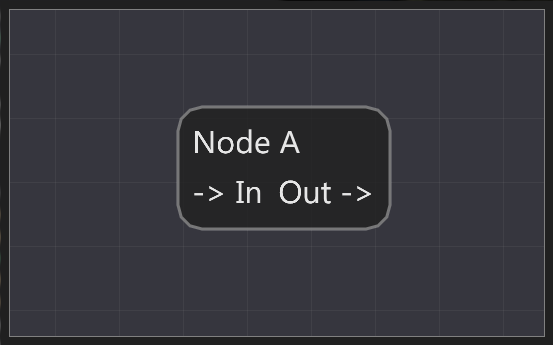

# Node Editor in ImGui

[](https://ci.appveyor.com/project/thedmd/imgui-node-editor/branch/master)
[](https://travis-ci.org/thedmd/imgui-node-editor)


## About

This is an implementaion of node editor with ImGui-like API.

Project purpose is to serve as a basis for more complex solutions like blueprint editors.


Node Editor is build around an idea "draw your content, we do the rest", which mean interactions are handled by editor, content rendering is handled by user. Editor will take care of:
 * placing your node in the word
 * dragging nodes
 * zoom and scrolling
 * selection
 * various interaction that can be quieried by API (creation, deletion, selection changes, etc.)

Here are some highlights:
 * Node movement and selection is handled internally
 * Node and pin contents are fully customizable
 * Fully stylled, default theme is modeled after UE4 blueprints
    - Flexibe enough to produce such nodes:

        
        
        
    - Customizable links based on Bézier curves:

        
        
        
 * Automatic highlights for nodes, pins and links:

    
 * Smooth navigation and selection
 * Node state can be saved in user context, so layout will not break
 * Selection rectangles and group dragging
 * Context menu support
 * Basic shortcuts support (cut/copy/paste/delete)
 * ImGui style API

Editor is used to implement blueprint editor in Spark CE engine, it proved itself there by allowing to do everything we needed. Therefore it is now slowly moving into stable state from beeing a prototype.

Please report issues or questions if something isn't clear.

## Dependencies

 * ~~Relies on modified version of ImGui 1.72 (WIP)~~
 * Vanilla ImGui 1.72 (WIP)
 * Optional extension you can pull into your local copy of ImGui node editor can take advantage of:
    - https://github.com/thedmd/imgui/tree/feature/draw-list-fringe-scale (for sharp rendering, while zooming)
    - https://github.com/thedmd/imgui/tree/feature/extra-keys (for extra shortcuts)
 * Examples dependencies:
    - https://github.com/thedmd/imgui/tree/feature/layout (used in blueprints sample only)
 * C++14

## Code

Editor code is in `NodeEditor` directory alone and can be build with CMake:
```
Windows:
    cmake -H. -BBuild -G "Visual Studio 15 2017 Win64"

macOS:
    cmake -H. -BBuild -G "Xcode"

Linux:
    cmake -H. -BBuild -G "Unix Makefiles"

Build:
    cmake --build Build --config Release
```
You will find examples in `Build\Bin` directory.

Source code target to be comatible with C++14.

### Example

Main node editor header is located in [imgui_node_editor.h](NodeEditor/Include/imgui_node_editor.h).

Minimal example of one node can be found in [Simple.cpp](Examples/00-Simple/Simple.cpp).
Press 'F' in editor to focus on editor content if you see only grid.
```cpp
# include "Application.h"
# include <imgui_node_editor.h>

namespace ed = ax::NodeEditor;

static ed::EditorContext* g_Context = nullptr;

void Application_Initialize()
{
    g_Context = ed::CreateEditor();
}

void Application_Finalize()
{
    ed::DestroyEditor(g_Context);
}

void Application_Frame()
{
    ed::SetCurrentEditor(g_Context);

    ed::Begin("My Editor");

    int uniqueId = 1;

    // Start drawing nodes.
    ed::BeginNode(uniqueId++);
        ImGui::Text("Node A");
        ed::BeginPin(uniqueId++, ed::PinKind::Input);
            ImGui::Text("-> In");
        ed::EndPin();
        ImGui::SameLine();
        ed::BeginPin(uniqueId++, ed::PinKind::Output);
            ImGui::Text("Out ->");
        ed::EndPin();
    ed::EndNode();

    ed::End();
}
```

Result:



For more details please visit [Examples](Examples) folder.

### Blueprints Example


### Here is Node Editor at work in Spark CE


